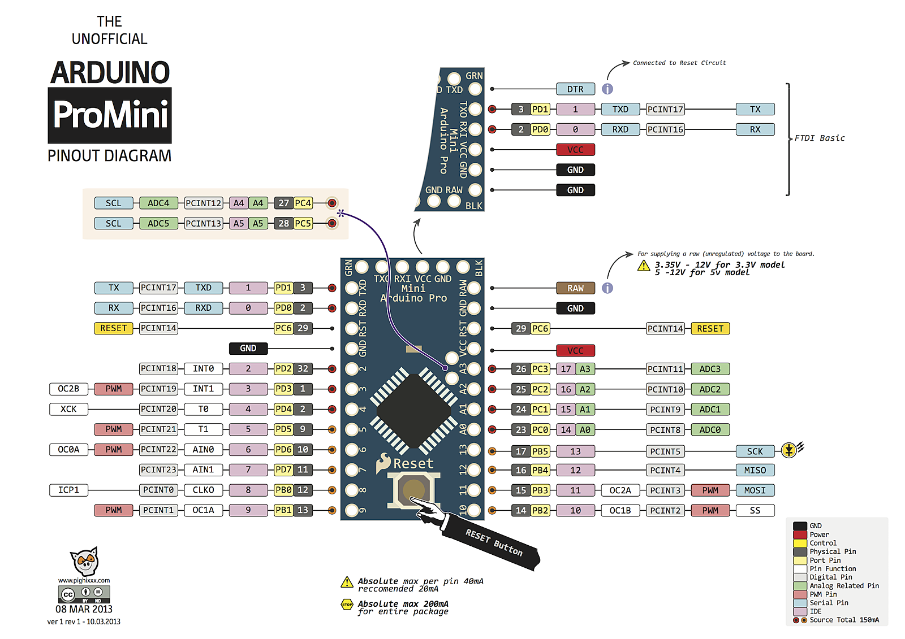

# 
***
## [목록]
* [설명서](#설명서)

***
## [추가예정]
* (1) 웹 시리얼 만들기 포트:81
***
## [보드 Arduino-Pro-Mini]
*  MCU : ATmega328
* 
---
## [PIN MAP]

Physical Pin(물리적인 핀) 보드 숫자
1 // FTDI-TXD		// PD1
0 // FTDI-RXD		// PD0
2
3
4
5
6
7
8
9
10
11
12
13

A0
A1
A2
A3

1 // FTDI-TXD		// PD1
0 // FTDI-RXD		// PD0
FTDI-VCC
FTDI-GND

출력:14개(PWM 6개)
6개의 PWM 포트(D3, D5, D6, D9, D10, D11)
PWM=3,5,6,9,10,11
1=PWM
9=PWM
10=PWM
13=PWM
14=PWM
15=PWM

>>>>>>>>>>>>>>>>>>>>>
출력:14개
12=PB0=PWM
13=PB1
14=PB2=PWM
15=PB3=PWM
12=PB4=PWM
13=PB5
14=PB6=PWM
15=PB7=PWM
12=PB8=PWM
13=PB9
14=PB10=PWM
15=PB11=PWM
12=PB12=PWM
13=PB13
전원 공급은 5V ~ 12V DC 범위로 공급해야하고,

>>>>>>>>>>>>>>>>>>>>>>
아날로그(8개)
23=A0
24=A1
25=A2
26=A3
27=A4
28=A5
19=A6
22=A7

>>>>>>>>>>>>>>>>>>>
프로 미니는 건전지 혹은 외부전원을 연결하는 곳은 RAW에 + GND에 -를 연결해줍니다.
>>>>>>>>>>>>>>>>>>
시리얼핀=0(RX), 1(TX)
>>>>>>>>>>>>>>>>>>>
외부 인터럽트=2,3
>>>>>>>>>>>>>>>>>>>

​
>>>>>>>>>>>>>>>>>>>
SPI=10(SS),11(MOSI),12(MISO),13(SCK)
>>>>>>>>>>>>>>>>>>>
LED = 13
>>>>>>>>>>>>>>>>>>>
IIC(I2C)
- 27=A4(SDA)
- 28=A5(SCL)
===========================
FT232  —-  보드
GND <==> GND
CTS <==> 
VCC <==> VCC
TXO <==> RXI
RXI <==> TXO
DTR <==> DTR(GRN) 시리얼 리셋

# []
https://arduino-esp8266.readthedocs.io/en/latest/installing.html#id1
***
# [즐겨찾기]
* https://cafe.naver.com/lsg20004/873
* https://cafe.naver.com/lh0006/2292
***
