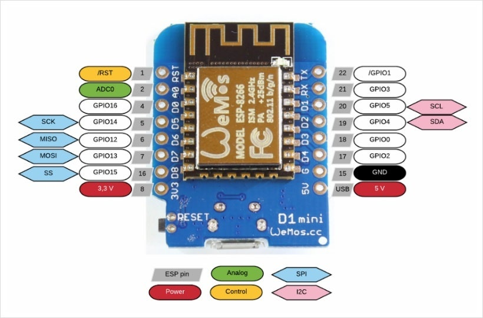
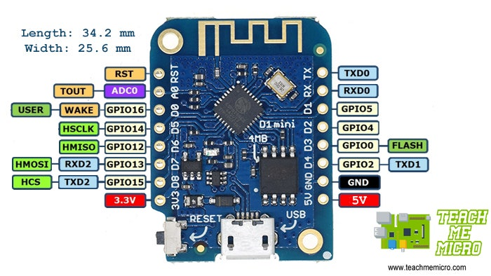
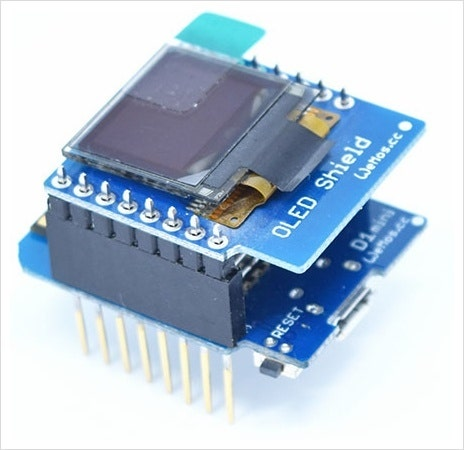
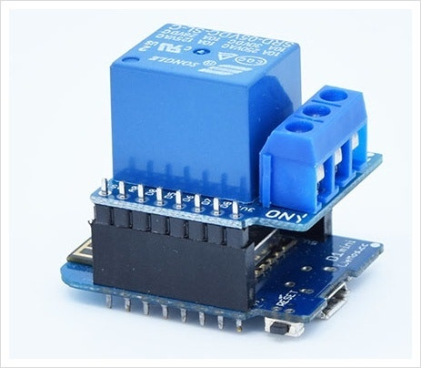
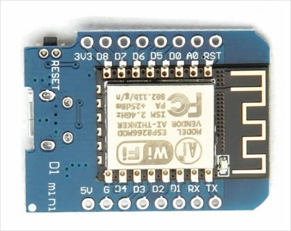

# D1 Mini (ESP8266)
***
# [목록]
* [설명서](#설명서)
* [보드정보](#보드-ESP8266)

***
# [설명서]
* (1)
*
# []
* (1) 
***
# [보드 ESP8266]





***
# [추가 라이브러리]
### [링크](https://cafe.naver.com/lsg20004/)
* Wifi 설정 값 변경
```
***
## [즐겨찾기]
* https://cafe.naver.com/lsg20004/
***
