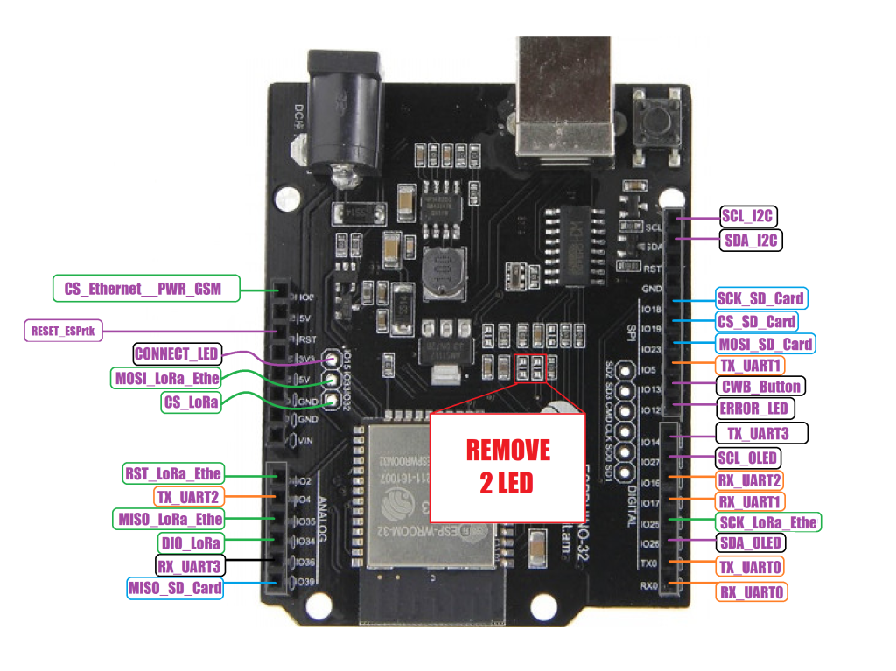
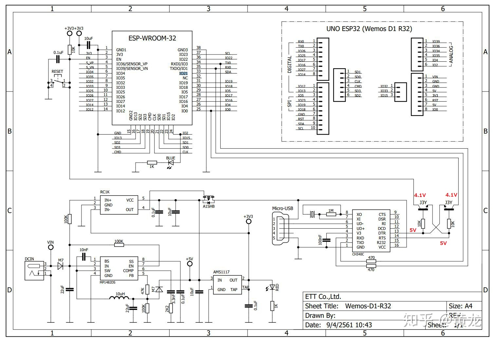
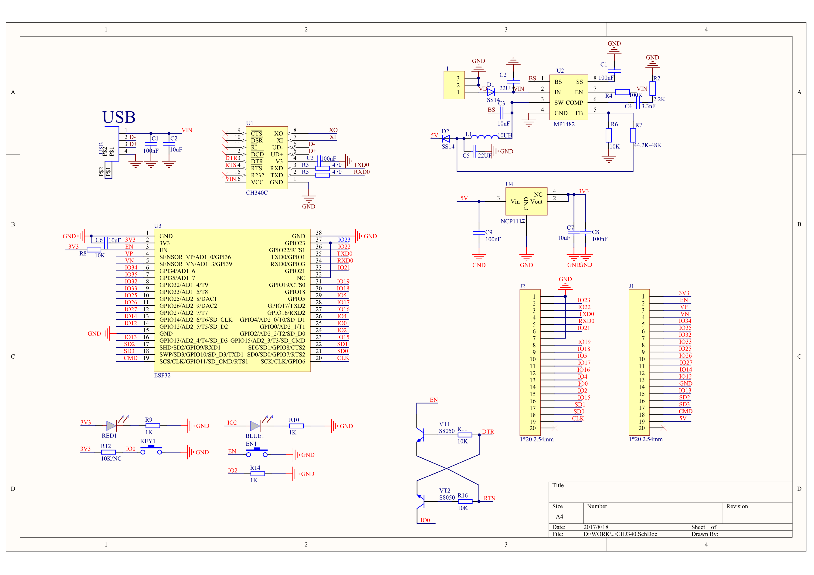
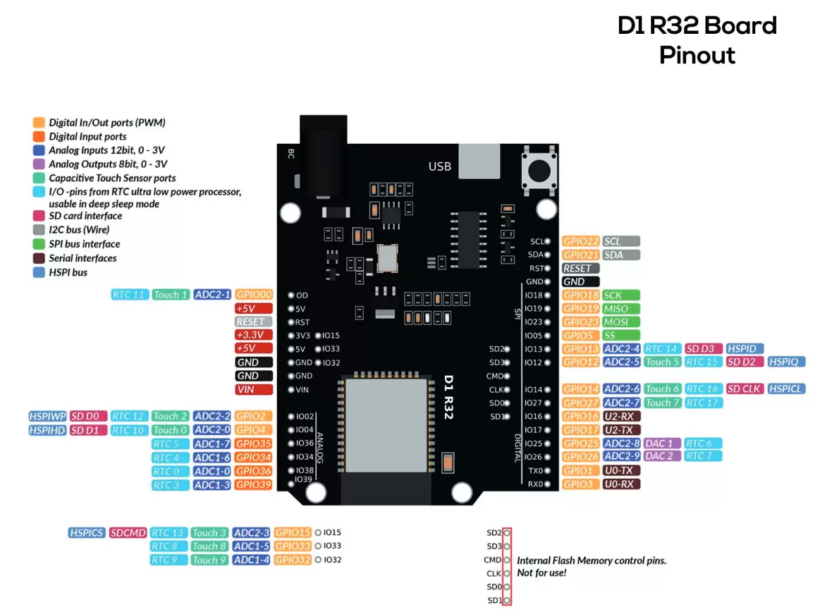

# ESPDuino-32
* ##### Wemos D1 R32
* ##### DOIT ESPDUINO-32(ESP-WROOM-32)
***
# [목록]
* [설명서](#설명서)
* [보드](#보드)
* [회로도](#회로도)
* [보드 구성](#보드-구성)
* [라이브러리](#추가-라이브러리)
* [즐겨찾기](#즐겨찾기)
* [핀 배열](#핀-배열)
* [추가예정](#추가예정)

***
# [설명서]
* [ESP32 내용](https://github.com/LH006/MCU_board/tree/main/ESP32)
* Tools → Board → ESP32 Arduino → ESPDuino-32
* Wemos D1 R32

***
# [보드]


# [회로도]


***
# [보드 구성]
* MCU: ESP32-WROOM-32 (dual-core Xtensa LX6, up to 240 MHz)
* Connectivity: Wi-Fi 802.11 b/g/n, Bluetooth v4.2 (BR/EDR + BLE)
* Form Factor: Arduino UNO–style pin layout (can use many UNO shields)
* Flash: Typically 4 MB
* GPIO: 36 pins (some multiplexed)
* USB-UART: CH340G or CP2102 (depends on version)
* Power: 5 V via USB or VIN pin, onboard 3.3 V regulator


* ///////////////////////////////////////////////

* Arduino Uno Shield와 호환
* 6개의 ADC 채널
* 2개의 DAC 채널
* PWM 장치 2개, 총 7개 채널
* 1 x SPI 장치
* 1 x I2C 장치
* 2개의 UART 장치

# [라이브러리]
* [WiFiManager](https://github.com/tzapu/WiFiManager)
* Wifi
* [WebSocketSerialMonitor](https://github.com/tzapu/WebSocketSerialMonitor)
* 웹 소켓 사용
***
# [즐겨찾기]
* https://cafe.naver.com/lsg20004/873
* https://cafe.naver.com/lh0006/2292
***

# [핀 배열]

* \packages\esp32\hardware\esp32\3.3.7\variants\d-duino-32
```
#ifndef Pins_Arduino_h
#define Pins_Arduino_h

#include <stdint.h>

static const uint8_t TX = 1;
static const uint8_t RX = 3;

static const uint8_t SDA = 5;
static const uint8_t SCL = 4;

static const uint8_t SS = 15;
static const uint8_t MOSI = 13;
static const uint8_t MISO = 12;
static const uint8_t SCK = 14;

static const uint8_t A0 = 36;
static const uint8_t A3 = 39;
static const uint8_t A10 = 4;
static const uint8_t A11 = 0;
static const uint8_t A12 = 2;
static const uint8_t A13 = 15;
static const uint8_t A14 = 13;
static const uint8_t A15 = 12;
static const uint8_t A16 = 14;
static const uint8_t A18 = 25;
static const uint8_t A19 = 26;

static const uint8_t T0 = 4;
static const uint8_t T1 = 0;
static const uint8_t T2 = 2;
static const uint8_t T3 = 15;
static const uint8_t T4 = 13;
static const uint8_t T5 = 12;
static const uint8_t T6 = 14;

static const uint8_t DAC1 = 25;
static const uint8_t DAC2 = 26;

// Wemos Grove Shield
static const uint8_t D1 = 5;
static const uint8_t D2 = 4;
static const uint8_t D3 = 0;
static const uint8_t D4 = 2;
static const uint8_t D5 = 14;
static const uint8_t D6 = 12;
static const uint8_t D7 = 13;
static const uint8_t D8 = 15;
static const uint8_t D9 = 3;
static const uint8_t D10 = 1;

// OLed
static const uint8_t OLED_SCL = SCL;
static const uint8_t OLED_SDA = SDA;

#endif /* Pins_Arduino_h */
```

# [추가예정]
