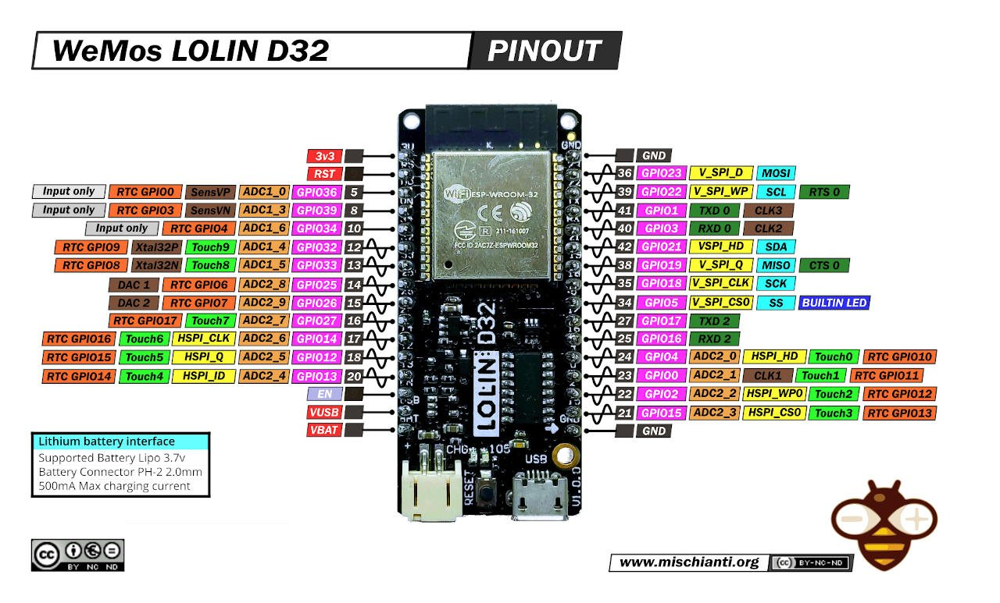

# LOLIN D32 (ESP32)
*
* 
***
# [목록]
* [설명서](#설명서)
* [보드](#보드)
* [회로도](#회로도)
* [보드 구성](#보드-구성)
* [라이브러리](#추가-라이브러리)
* [즐겨찾기](#즐겨찾기)
* [핀 배열](#핀-배열)
* [추가예정](#추가예정)

***
# [설명서]
* Tools → Board → LOLIN D32
* [ESP32 내용](https://github.com/LH006/MCU_board/tree/main/ESP32)
* https://www.wemos.cc/en/latest/d32/d32.html

***
# [보드]


# [회로도]


***
# [보드 구성]
* ESP32-WROOM-32 module
* Flash Memory: 4 MB (some versions have 16 MB)
* SRAM: 520 KB
* Connectivity:
   * Wi-Fi 802.11 b/g/n
   * Bluetooth v4.2 BR/EDR and BLE
* Operating Voltage: 3.3 V logic
* USB-to-Serial: CP2104 or CH340C (depends on version)
   * Power Supply:
   * USB 5 V
   * LiPo battery (with built-in charger)
* Battery Charging: Integrated Li-ion/LiPo charger (via JST-PH connector)
* GPIO Pins: 34 (some reserved for internal functions)
* Analog Inputs: 12-bit ADC (up to 18 channels)
* DAC Outputs: 2 channels (8-bit)
* PWM: Up to 16 channels
* I²C, SPI, UART: Multiple hardware interfaces

# [라이브러리]
* [WiFiManager](https://github.com/tzapu/WiFiManager)
* Wifi
* [WebSocketSerialMonitor](https://github.com/tzapu/WebSocketSerialMonitor)
* 웹 소켓 사용
***
# [즐겨찾기]
* https://cafe.naver.com/lsg20004/873
* https://cafe.naver.com/lh0006/2292
***

# [핀 배열]

```
////////////////////////////////////////////////////////////////////////////////
// 보드
////////////////////////////////////////////////////////////////////////////////
// 핀 좌측
// 01. 3V
// 02. RS
// 03. VP
// 04. VN
// 05. GPIO34 //ADC1_CH6 //입력전용
// 06. GPIO32 //ADC1_CH4
// 07. GPIO33 //ADC1_CH5
// 08. GPIO25 //ADC2_CH8 //DAC1
// 09. GPIO26 //ADC2_CH9 //DAC2
// 10. GPIO27 //ADC2_CH7
// 11. GPIO14 //ADC2_CH6
// 12. GPIO12 //ADC2_CH5
// 13. GPIO13 //ADC2_CH4
// 14. EN
// 15. USB
// 16. BAT
////////////////////////////////////////////////////////////////////////////////
// 핀 우측
// 01. GND
// 02. GPIO23 //L1
// 03. GPIO22 //L2
// 04. GPIO1 // TXD0
// 05. GPIO3 // RXD0
// 06. GPIO21 //L3
// 07. GPIO19 //L4
// 08. GPIO18
// 09. GPIO5	//내장LED
// 10. GPIO17 //TXD2
// 11. GPIO16 //RXD2
// 12. GPIO4 //ADC2_CH0
// 13. GPIO0 //ADC2_CH1
// 14. GPIO2 //ADC2_CH2
// 15. GPIO15 //ADC2_CH3
// 16. GND
```

* 디지털 I/O: 22개
* 아날로그 입력(ADC): 6개 (VP, VN, 32, 33, 34, 35).
* 아날로그 출력(DAC): 2개 (25, 26).
* 특수 기능: 배터리 전압 측정을 위해 내부적으로
* GPIO 35번에 분압 저항이 연결되어 있어 외부 회로 없이 배터리 잔량을 확인가능

# [배터리 잔량]
```C++
//////////////////////////////////////////////////////////////////
float Battery()
{
  // 1. 전압 측정 (이전 단계 코드 활용)
  // ADC 값 읽기 (0 ~ 4095)
  int adcValue = analogRead(PIN_BATTERY_CHECK);

  // ADC 값을 전압(V)으로 변환
  // 1. ESP32의 기준 전압은 보통 3.3V입니다.
  // 2. LOLIN D32 내장 회로는 전압을 1/2로 낮추므로, 다시 2를 곱해줘야 합니다.
  // 3. 12비트 ADC이므로 4095로 나눕니다.
  float voltage = (adcValue * 3.3 * 2.0) / 4095.0;

  // 배터리 잔량(%) 계산
  int percentage = 0;

  // 리튬 배터리 전압 구간별 매핑 (대략적인 수치)
  if (voltage >= 4.2)
  {
    percentage = 100;
  }
  else if (voltage >= 3.7)
  {
    // 4.2V(100%) ~ 3.7V(50%) 구간
    percentage = mapFloat(voltage, 3.7, 4.2, 50, 100);
  }
  else if (voltage >= 3.3)
  {
    // 3.7V(50%) ~ 3.3V(0%) 구간
    percentage = mapFloat(voltage, 3.3, 3.7, 0, 50);
  }
  else
  {
    percentage = 0;
  }

  // 3. 결과 출력
  Serial.print("Voltage: ");
  Serial.print(voltage);
  Serial.print("V | Remaining: ");
  Serial.print(percentage);
  Serial.println("%");
  return voltage;
}
//////////////////////////////////////
// 실수(float)를 위한 매핑 함수
float mapFloat(float x, float in_min, float in_max, float out_min, float out_max)
{
  float result = (x - in_min) * (out_max - out_min) / (in_max - in_min) + out_min;
  return constrain(result, out_min, out_max);
}

// 전압 범위 설정: 리튬 배터리는 보통 4.2V가 완충, 3.3V 내외가 방전 상태입니다.
// 비선형 특성: 배터리는 3.7V 근처에서 전압이 오래 유지되다가 그 이하로 떨어지면 급격히 방전됩니다. 위 코드는 이를 반영하여 3.7V를 50% 기준으로 잡았습니다.
// 멀티샘플링: ADC 값의 미세한 떨림을 줄이려면 analogRead를 10번 정도 반복해 평균값을 내는 것이 좋습니다.
// 보정: 실제 테스터기로 측정한 전압과 시리얼 모니터에 뜨는 값이 다르다면 3.3이나 2.0 값을 소수점 단위로 미세하게 조정하세요.
```

# [추가예정]
