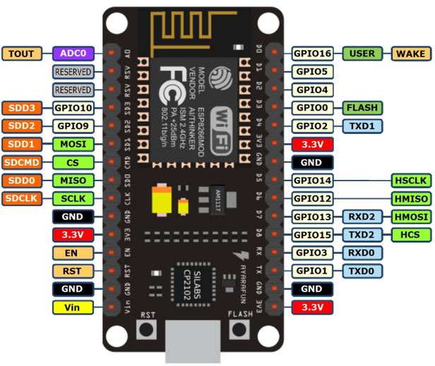

# NodeMCU V1.0
## ESP8266(ESP-12E Module)
***
# [목록]
* [설명서](#설명서)
* [추가예정](#추가예정)
* [보드정보](#보드-ESP8266)
* [라이브러리](#추가-라이브러리)
* [즐겨찾기](#즐겨찾기)
***
# [추가예정]
* (1)
***
# [보드정보]

# []
* Module with build in ESP-12E with PCB antenna
* WiFi connectivity: 802.11 b/g/n
* Modes: (Access Point), STA (Standalone), AP+STA
* Supports: TKIP, WEP, CRC, CCMP, WPA/WPA2, WPS
* Supply voltage: 3.3V (or 5V via micro USB port)
* CPU: RISC 80MHz (overclockable to 160MHz)
* 10 bit GPIO - PWM

https://cafe.naver.com/lsg20004/884
* I2C
* SPI 
* 1-Wire
* Max current on I/O pins: 12mA
* USB-UART converter - CH340
Build in ADC - 10-bitowy
30 pins in 2,54mm raster
micro USB socket
Size: 58 x 30mm

# []
https://arduino-esp8266.readthedocs.io/en/latest/installing.html#id1
***
# [즐겨찾기]
* https://cafe.naver.com/lsg20004/873
* https://cafe.naver.com/lh0006/2292
***
